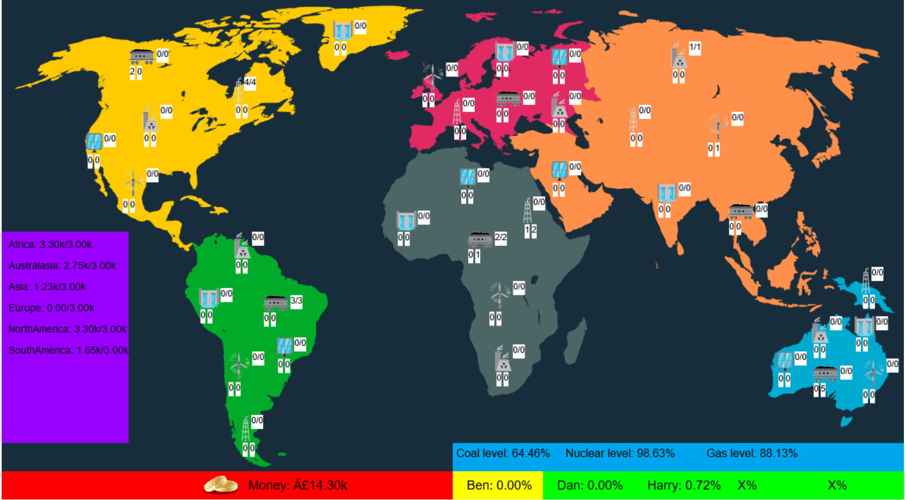

# Green-or-Greed

Green or Greed is a multiplayer, strategy game, created during 24 hours at the Bristol Computer Science Society annual Hackathon. The theme of the hackathon was 'sustainability and the environment' and so Green or Greed is a game designed to highlight the economical challenges of converting the world to renewable energy.

Each player, plays as the owner of a energy company, who using their money can decide to build power stations using different types of resouces (coal, gas, nuclear, hydro-electric, solar or wind), in different continents of the world. The non-renewable power stations (although cheaper and yield higher energy outputs) can only operate while the respective non-renewable resource exists in the world. However, the more stations which use a particular non-newable resource, the faster that resource becomes scarce, causing the costs of buying that fuel to rise considerably.

At the same time, each of the continents has an energy demand and pays out to each player based on the amount of energy they supply to that continents 'energy grid'. This setup encourages players to initially build non-renewable facilities (with higher yields) and then to invest in renewable energy facilities in the long term. 

The game ends when the entire world is being provided by green energy, at which point, the player supplying the most green energy to the world is deemed the winner. 

In order for players to compete against each other, each energy company can 

- Advertise in each continent, encouraging a region to prioritise energy supplied by them, rather than competitors 

- Lobby the governing body of a continent to reduce the taxes enforced on a particular fuel type 

- Conduct research into a particular resource in order to improve the efficiency of their power stations. 

